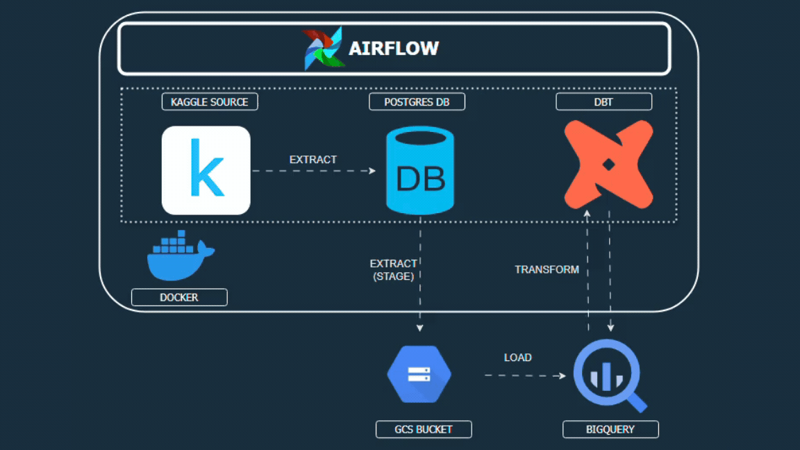
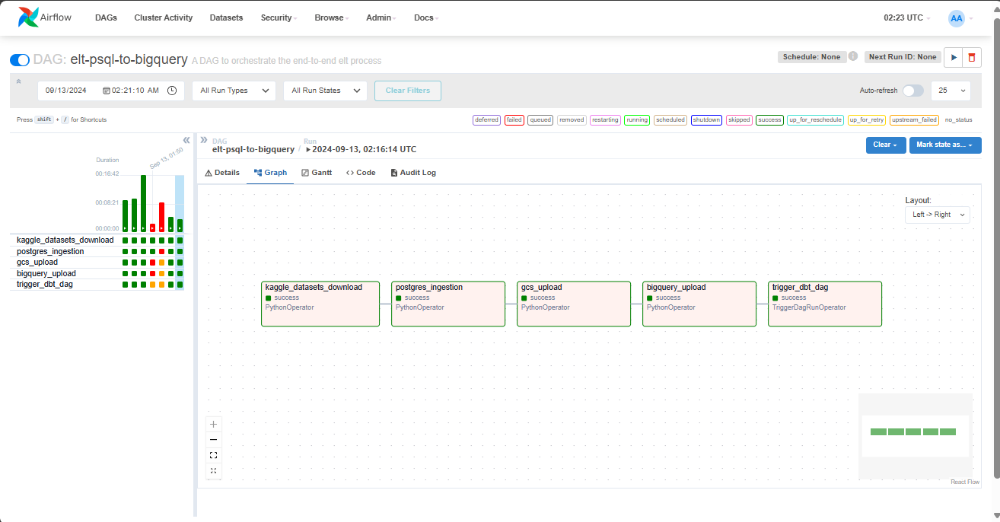
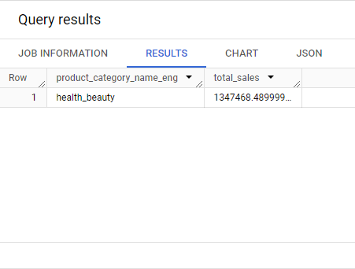
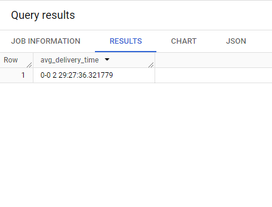
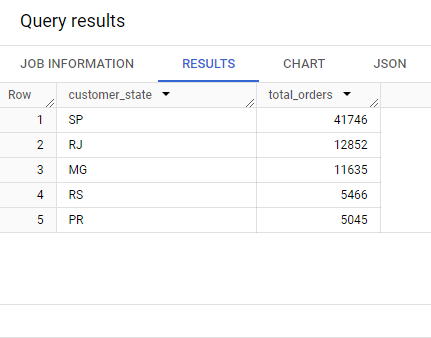

# olist-store-brazil


## Table of Contents

- [Overview](#overview)
- [Architecture](#architecture)
- [Data Transformations](#data-transformations)
- [Prerequisites](#prerequisites)
- [Getting Started](#getting-started)
    - [Setup Instructions](#setup-instructions)
        - [Create Kaggle API token](#creating-kaggle-api-token)
        - [Creating a Service Account](#creating-a-service-account)
        - [Inserting your Configurations](#inserting-your-configurations)
    - [Testing the Pipeline](#testing-the-pipeline)
    - [Airflow UI - Triggering DAG](#airflow-ui---triggering-dag)
- [Analysis](#analysis)
- [Contributing](#contributing)
- [License](#license)


## Overview
This repository contains my capstone project for the Data Engineering course at Altschool Africa. It demonstrates my capability to develop a comprehensive end-to-end ELT process for an organization using tools such as Airflow, dbt, Docker, BigQuery and PostgreSQL.


## Architecture
I opted to use an ELT pipeline architecture. The pipeline automates the process of extracting data from a [kaggle datasets](https://www.kaggle.com/datasets/olistbr/brazilian-ecommerce), loading it into a PostgreSQL database, staging each table in a Google Cloud Storage (GCS) bucket, uploading the staged data into a Bigquery Dataset and using dbt to transform the raw data and write the transformed data into datasets in Bigquery.




## Data Transformations
All transformations to the data were done with a singular tool, **`dbt`**. This was used to build models, clean up the raw data, and ensure data quality by running tests and enforcing the correct data types for columns.

Over 15 models were built and to properly explain them I shall be classifying them into 4 types (Base, Staging, Intermediate and Final Models).

- Base Models: This model prefixed with `base_` was joined with a staging model to give extra context to the model. The model is not used anywhere else downstream so there is no reason to make it a staging model. For this project, the `product_category_name_translation` table served as a base model to the `products` table to translate the product_category_name to English from Portuguese.

- Staging Models: This model prefixed with `stg_` serves as a source that maps one-to-one with the raw tables. This helps with complex queries downstream. Each staging model has a "<model_name>.yml" file where unique, not null, and relationship tests are defined and also descriptions of columns are included. For this project, renaming columns and selecting suitable data types were done with the staging models. 

- Intermediate Models: This model prefixed with `int_` performs complex queries like joins and aggregations. It is built upon the staging models.

- Final Models: This model prefixed with `fct_` provides clean and transformed data requested by the stakeholder. They are usually narrowed down to a specific business goal/objective.

## Prerequisites
- Google Cloud Platform account
- Docker Desktop installed 
- Python 3.10 or above installed
- Kaggle Account

## Getting Started
Clone the repository to your preferred destination
```bash
git clone https://github.com/bazuayelewis/olist-store-brazil.git
```


### **Setup Instructions**
### Creating Kaggle API Token
1. Go to your [Kaggle](https://www.kaggle.com/settings) Account
2. Create a new token
3. Copy your key and username from the JSON file

### Creating a Service Account
1. Go to [Google Cloud Service Account](https://console.cloud.google.com/iam-admin/serviceaccounts)
2. Select the Project you are working with
3. Create a service account
4. Grant the following roles to the service account(Storage Admin, Bigquery Data Editor, Bigquery Job User)
5. Add a new key and download as a json file


### Inserting your Configurations
Update your [`.env`]() script with your configurations. Check out the [`.env.example`](/airflow/.env.example) for required variables.
```bash
# REQUIRED
GOOGLE_AUTH_CRED=~/your/service/account/path.json
PROJECT_ID=your-gcp-project-id
KAGGLE_USERNAME=your-kaggle-username # Go to kaggle and create an API token
KAGGLE_KEY=your-key-id
```

Also check out the [`.env.example`](/airflow/.env.example) for optional variables default values.

```bash
# OPTIONAL
POSTGRES_USER=your-postgres-username #defaults to airflow
POSTGRES_PASSWORD=your-postgres-password #defaults to airflow
POSTGRES_DB=your-postgres-database #defaults to airflow
POSTGRES_PORT=your-postgres-port #defaults to 5432
POSTGRES_HOST=your-postgres-host #defaults to postgres
```

### **Testing the Pipeline**
To test the pipeline, run the following commands;
```bash
cd airflow
docker-compose up -d
```

Once all services are healthy. Go to [`http://127.0.0.1:8080/`](http://127.0.0.1:8080/) in your browser


### **Airflow UI - Triggering DAG**

Navigate to the airflow UI and login with your credentials. If not set use default credentials:- username: *`airflow`*, password: *`airflow`* 

After successfully logging in, navigate to the `elt-psql-to-bigquery` DAG and manually trigger it. This could also be set to run on a schedule.


## Analysis
1. Which product categories have the highest sales?
```sql
SELECT 
    product_category_name
    , total_sales 
FROM 
    olist_reporting.fct_sales_by_category
WHERE 
    total_sales = (
        SELECT MAX(total_sales) AS highest_sales
        FROM olist_reporting.fct_sales_by_category
        )
```



2. What is the average delivery time for orders?
```sql
SELECT 
    AVG(delivery_time) AS avg_deliver_time
FROM 
    olist_reporting.fct_avg_delivery_time
--Average delivery time: 2 days 29 hours 27 minutes 36 seconds
```



3. Which states have the highest number of orders?
```sql
-- TOP 5 STATES WITH THE MOST ORDERS
SELECT customer_state, total_orders
FROM olist_reporting.fct_orders_by_state
ORDER BY total_orders desc   --Not needed since the int_orders_by_state model is already ordered
LIMIT 5
```




## Contributing
Contributions are welcome! Please fork the repository and create a pull request with your changes. I would review and approve if necessary.

## License 
This project is licensed under the MIT License 
